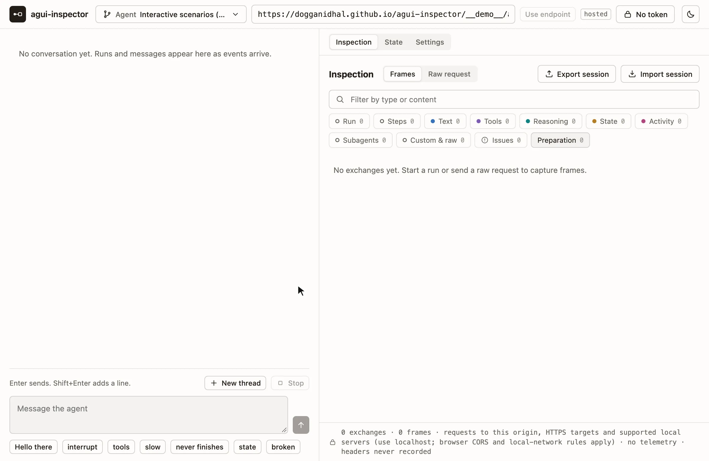

<div align="center">


# agui-inspector

A developer tool for [AG-UI](https://docs.ag-ui.com) servers. Point it at an agent and see every request and event.

[Try the demo](https://dogganidhal.github.io/agui-inspector/) · [Documentation](https://dogganidhal.github.io/agui-inspector/docs/) · [Roadmap](ROADMAP.md) · [Contributing](CONTRIBUTING.md)

[](https://github.com/dogganidhal/agui-inspector/actions/workflows/pages.yml)
[](LICENSE)
[](https://pypi.org/project/agui-inspector/)
[](https://docs.ag-ui.com)
[](https://dogganidhal.github.io/agui-inspector/docs/a2ui/)

</div>

<picture>
  <source media="(prefers-color-scheme: dark)" srcset="docs/images/showcase-dark.webp">
  
</picture>

agui-inspector sends runs to your AG-UI agent and records every request and every event that comes back, in order and
with its timing. It checks each event against the protocol and keeps the frames that break it in the list. It
answers interrupts, tool calls and A2UI surfaces the way a client does, and it can also send requests that no client
would send.

## Try it

### In your browser

Open the [public demo](https://dogganidhal.github.io/agui-inspector/). You install nothing. Pick an example agent and
send one of its quick messages. The examples run inside the page, so no model or server is involved. You can also type
the URL of your own server. [Try your first run](https://dogganidhal.github.io/agui-inspector/docs/demo/) walks you
through it.

### In a Python app

Install the package with the `embedded` extra, which adds Starlette:

```sh
pip install "agui-inspector[embedded]"
# or, in a uv project:
uv add "agui-inspector[embedded]"
```

Then mount the inspector in your Starlette or FastAPI app:

```python
from agui_inspector import Agent, mount_inspector

mount_inspector(
    app,
    agents=[Agent(id="support", url="/agents/support/stream")],
    enabled=settings.debug,
)
```

Open `/agui-inspector/` in your app. Keep `enabled` tied to a development setting, because anyone who can open the page
sees request bodies and raw frames.
[Embed in Starlette or FastAPI](https://dogganidhal.github.io/agui-inspector/docs/embedding/) covers authentication,
routes and an example app.

### In an Express, Hono or Next.js app

The npm package has a helper for each, in the next release ([0.2.0](ROADMAP.md#020)):

```ts
import { mountInspector } from 'agui-inspector/express'; // or 'agui-inspector/hono'

mountInspector(app, {
  agents: [{ id: 'support', url: '/agents/support/stream' }],
  enabled: process.env.NODE_ENV !== 'production',
});
```

In Next.js, a route file exports `inspectorRoute({ agents, enabled })`.
[Embed in your server](https://dogganidhal.github.io/agui-inspector/docs/embedding/#javascript-servers) covers the
arguments, authentication and routes.

### With any other server

A server in any other language can use the hosted page: deploy it on any static host, or point the public demo at
your server. Your server must allow the page's origin through CORS.
[Host the static page](https://dogganidhal.github.io/agui-inspector/docs/hosted/) explains both.

## What it does

- Records each HTTP exchange and each Server-Sent Events (SSE) frame exactly as it arrived, with its timing. It never
  drops, repairs or reorders a frame, even one that is not JSON.
- Checks frames against the AG-UI schemas and the event order, and shows each problem on its frame and its run.
- Shows all 31 AG-UI event types in a frames list with a timeline, a conversation view and a state view.
- Lets you answer interrupts and client tool calls by hand, or set them in the client profile so they are answered for you, and draws A2UI v0.9 surfaces with the official renderer.
- Sends raw JSON exactly as you type it, including run inputs that break the schema.
- Reads agents and presets from a configuration file, saves sessions to a file and opens them again later, and restyles
  through ten CSS properties for light and dark mode, without a rebuild.

## Privacy

- The page sends no telemetry and loads nothing from other sites. It talks only to its own origin and to the servers
  you choose, and it loads scripts only from its own origin.
- A token you type stays in memory. The inspector never writes it to storage, recordings or exports, and it never
  records headers.
- Frames are kept exactly as your server sent them. If your server repeats a secret, the recording keeps it, and the
  export dialog warns you.

[Project status and privacy](https://dogganidhal.github.io/agui-inspector/docs/status/) has the details. To report a
vulnerability, see [SECURITY.md](SECURITY.md).

## Documentation

The guides are at <https://dogganidhal.github.io/agui-inspector/docs/>. Good places to start:

- [Try your first run](https://dogganidhal.github.io/agui-inspector/docs/demo/): a guided tour of the demo.
- [Embed in Starlette or FastAPI](https://dogganidhal.github.io/agui-inspector/docs/embedding/) and
  [Host the static page](https://dogganidhal.github.io/agui-inspector/docs/hosted/): set it up for your server.
- [Read frames and findings](https://dogganidhal.github.io/agui-inspector/docs/inspection/): understand what the
  inspector shows.
- [Troubleshooting](https://dogganidhal.github.io/agui-inspector/docs/troubleshooting/): what to check when a request
  fails.

## Status

Version 0.1.0 is on [PyPI](https://pypi.org/project/agui-inspector/) and [npm](https://www.npmjs.com/package/agui-inspector).
The [Python changelog](packages/python/CHANGELOG.md) and the [npm changelog](packages/inspector/CHANGELOG.md) list what
each release changed. The [roadmap](ROADMAP.md#020) lists what 0.2.0 plans.

## Contributing

You need Node 24 or newer, and [uv](https://docs.astral.sh/uv/) for the Python package.

```sh
npm ci --ignore-scripts            # install without lifecycle scripts
npx playwright install chromium    # browser for the end-to-end tests
npm run check:ci                   # the same checks as a pull request
```

[CONTRIBUTING.md](CONTRIBUTING.md) explains how to propose a change, and
[Development](https://dogganidhal.github.io/agui-inspector/docs/development/) lists every command. The
[constitution](.specify/memory/constitution.md) holds the engineering rules, and [specs/](specs) holds the feature
specifications.

## License

[MIT](LICENSE), Copyright (c) 2026 Nidhal Dogga. Bundled dependencies and their licenses are listed in
[THIRD_PARTY_NOTICES.txt](THIRD_PARTY_NOTICES.txt).

agui-inspector is an independent project. [AG-UI](https://github.com/ag-ui-protocol/ag-ui) and
[A2UI](https://a2ui.org) are open protocols with their own maintainers.
