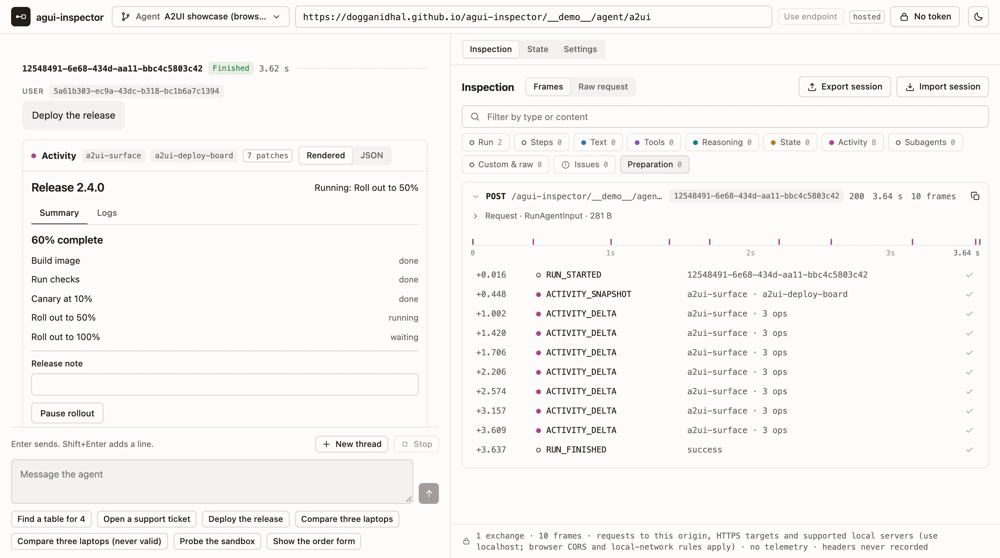
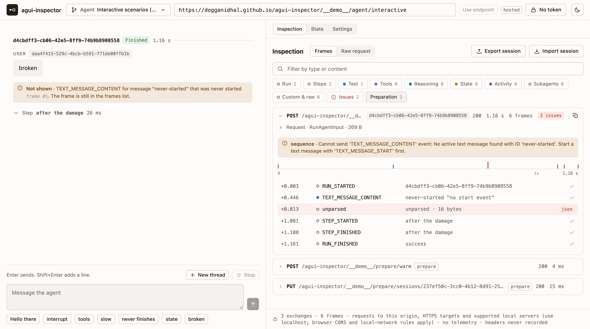

<div align="center">


# agui-inspector

A developer tool for [AG-UI](https://docs.ag-ui.com) servers. Point it at an agent and see the wire.

[Live demo](https://dogganidhal.github.io/agui-inspector/) · [Documentation](#documentation) · [Roadmap](ROADMAP.md) · [Contributing](CONTRIBUTING.md)

[](https://github.com/dogganidhal/agui-inspector/actions/workflows/pages.yml)
[](LICENSE)
[](https://docs.ag-ui.com)
[](docs/a2ui.md)

</div>

<picture>
  <source media="(prefers-color-scheme: dark)" srcset="docs/images/run-dark.webp">
  
</picture>

agui-inspector shows every request it sends and every event that comes back, in order, with its timing, checked
against the protocol. It drives runs the way a client does, answering interrupts, tool calls and A2UI surfaces, and it
can send the requests no client would.

## Try it

Open the [public demo](https://dogganidhal.github.io/agui-inspector/). There is nothing to install. Pick an example
agent beside the endpoint and send one of its quick messages: a plain reply, interrupts, client tool calls, state
updates, a broken stream, seven A2UI stories and every baseline event type. The examples are scripted and answered by a
service worker inside the page, so no model or server is involved.

To inspect your own server, type its URL in the connection bar. Your browser sends the request directly, so the server
has to allow `https://dogganidhal.github.io` through CORS. A local server works at `http://localhost:<port>`. The
[public demo guide](docs/public-demo.md#your-own-server) covers the limits.

## What it does

- Records each HTTP exchange and SSE frame exactly as it arrived, with its timing. Frames that are not JSON or that
  break the protocol stay in the list; nothing is dropped, repaired or reordered.
- Validates frames against the AG-UI schemas and event sequence rules, and marks each finding on its frame and run.
- Shows all 31 baseline event types in a filterable frames list with a timeline, a conversation view and a state view.
- Answers interrupts and client tool calls by hand, and draws A2UI v0.9 surfaces with the official renderer, sending
  their actions back to the agent.
- Sends raw JSON from an editor unchanged, including run inputs that fail the schema.
- Reads agents and presets (variables, preparation requests, forwarded properties) from a configuration file, and keeps
  client profiles in the browser with JSON import and export. Sessions export to a file and import again later.
- Restyles through ten public `--agui-*` CSS properties for light and dark mode, with no rebuild.

<picture>
  <source media="(prefers-color-scheme: dark)" srcset="docs/images/issues-dark.webp">
  
</picture>

## Use it with your server

The 0.1.0 packages are not on PyPI or npm yet. Until the first release, build them from a checkout (see
[Development](#development)).

| Mode | How it works | Status |
| --- | --- | --- |
| Embedded | `mount_inspector` serves the page from your Starlette or FastAPI app, on the same origin as your agents. | 0.1.0 |
| Hosted | A static page you deploy anywhere, with a `hosting-config.json` that lists the origins it may reach. | 0.1.0, [live demo](https://dogganidhal.github.io/agui-inspector/) |
| Static assets | `staticAssetsPath` from the npm package, for any other server to serve. | 0.1.0 |
| CLI | `npx agui-inspector --target <url>` with a local proxy. | Planned for 1.0.0 |
| In-app | A custom element that watches an `AbstractAgent` your application already runs. | Planned for 1.0.0 |

### Embedded in Starlette or FastAPI

```python
from agui_inspector import Agent, mount_inspector

mount_inspector(
    app,
    agents=[Agent(id="support", url="/agents/support/stream")],
    enabled=settings.debug,
)
```

The page appears at `/agui-inspector/`, behind the authentication your app already has, and calls your agent routes on
the same origin. `enabled` defaults to `False`. Keep it tied to a debug setting: anyone who reaches the route sees
request bodies and raw frames. Once the package is released, install it with `pip install "agui-inspector[embedded]"`.
See [embedding](docs/embedding.md) and the [FastAPI example](examples/fastapi/app.py).

### Hosted

`npm run build` writes the page to `packages/inspector/dist`. Deploy that directory to any static host with a
`hosting-config.json` that names the agent origins the page may call, and optionally a `config.json` that lists your
agents. The page builds its content security policy from that file at startup and refuses every other destination. See
[hosted](docs/hosted.md) and [configuration](docs/configuration.md).

## Privacy

- The page sends no telemetry and loads nothing from third parties. It talks to its own origin and the targets you
  configure.
- A token you type stays in memory. The inspector never writes it to storage, configuration, recordings or exports, and
  the recorder never reads headers.
- What a server sends is kept as sent, even when it echoes a credential. The export dialog warns that raw frames may hold
  sensitive data.
- Scripts load only from the page's origin, and `eval` is blocked by the content security policy.

To report a vulnerability, see [SECURITY.md](SECURITY.md).

## Status

The 0.1.0 MVP is implemented on `main`, and the public demo has been live since 2026-10-02. Nothing is published yet.
Before the first release, the maintainer still has to run the 5,000-frame benchmark on the reference machine (SC-009)
and a manual smoke test of each mode. The Python package will then ship to PyPI through Changesets and trusted
publishing; the npm release is not set up. [ROADMAP.md](ROADMAP.md) tracks the release, the 1.0.0 plans and the open
decisions.

## Documentation

| Page | What it covers |
| --- | --- |
| [Public demo](docs/public-demo.md) | The example agents, their pacing, and pointing the demo at your own server. |
| [Embedding](docs/embedding.md) | `mount_inspector` for Starlette and FastAPI: arguments, routes, authentication. |
| [Hosted](docs/hosted.md) | Static deployment, `hosting-config.json` and the content security policy. |
| [Configuration](docs/configuration.md) | `config.json`, presets, client profiles and migrations. |
| [Connecting and driving runs](docs/conversation.md) | Endpoints, tokens, interrupts, tool results, raw submissions, Stop and New thread. |
| [Event views](docs/event-views.md) | How each of the 31 event types reaches the conversation and state views. |
| [Inspection](docs/inspection.md) | What the recorder keeps, how bytes become frames, and the findings it reports. |
| [A2UI surfaces](docs/a2ui.md) | Rendering `a2ui-surface` activities and sending their actions. |
| [Session recordings](docs/recordings.md) | The session file format and what to check before sharing one. |
| [Theming](docs/theming.md) | The `--agui-*` properties and the view primitives. |
| [Distribution](docs/distribution.md) | Release gates and how the Python release works. |
| [Build provenance](docs/build-provenance.md) | The checks that tie packaged assets to the build. |
| [Dependencies](docs/dependencies.md) | Why each dependency is there. |
| [Development](docs/development.md) | Every command, the CI gate and the benchmark. |

The [constitution](.specify/memory/constitution.md) holds the engineering rules, and [specs/](specs) holds the feature
specifications, plans and tasks.

## Development

You need Node 24 or newer, and [uv](https://docs.astral.sh/uv/) for the Python package.

```sh
npm ci --ignore-scripts            # lockfile install, no lifecycle scripts
npx playwright install chromium    # browser for end-to-end tests
npm run check:ci                   # the pull request gate
```

`npm run build` builds the page and `npm run package:python` builds the wheel and sdist into `packages/python/dist`.
[docs/development.md](docs/development.md) lists every command, and [CONTRIBUTING.md](CONTRIBUTING.md) explains how
to propose a change.

## License

[MIT](LICENSE), Copyright (c) 2026 Nidhal Dogga. Bundled dependencies are listed with their licenses in
[THIRD_PARTY_NOTICES.txt](THIRD_PARTY_NOTICES.txt).

agui-inspector is an independent project. [AG-UI](https://github.com/ag-ui-protocol/ag-ui) and
[A2UI](https://a2ui.org) are open protocols maintained by their own projects.
